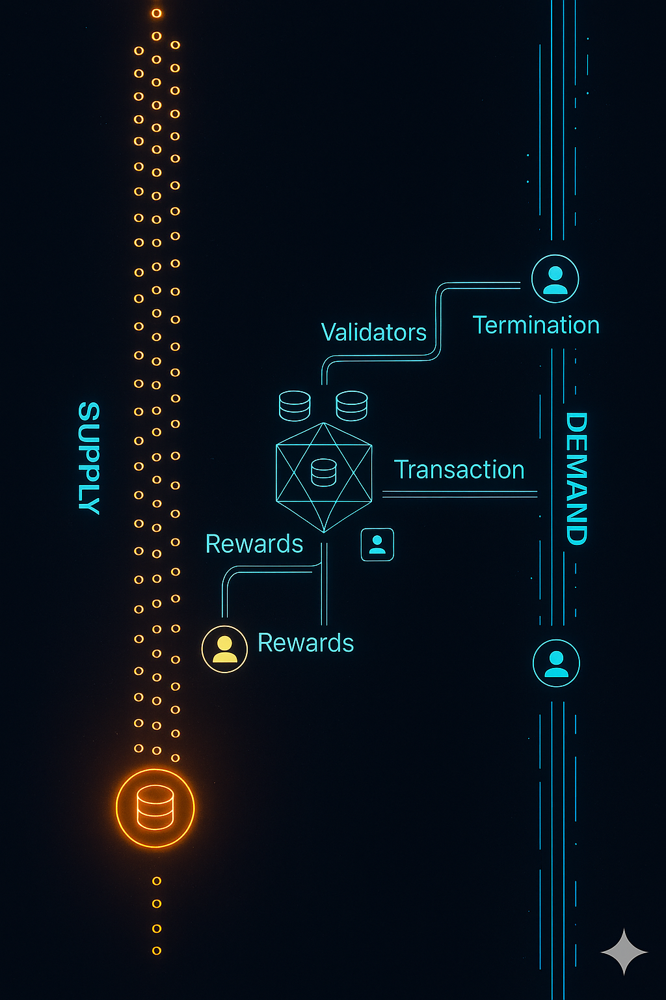

import DocCardList from '@theme/DocCardList';

The economic research efforts are divided into two main directions. The first focuses on **academic research**, which aims to advance scientific understanding and contribute to peer-reviewed journals and conferences. The second focuses on **applied research**, where insights are directly used to address real-world challenges of the Polkadot protocol—often culminating in RFCs that drive protocol improvements.

<DocCardList />
