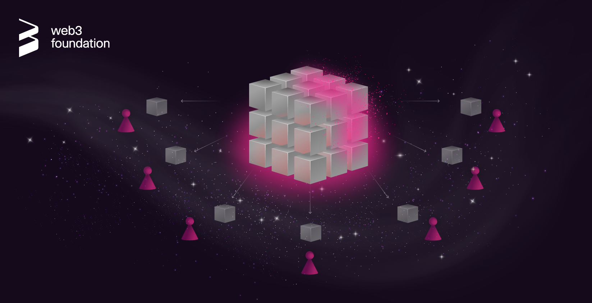
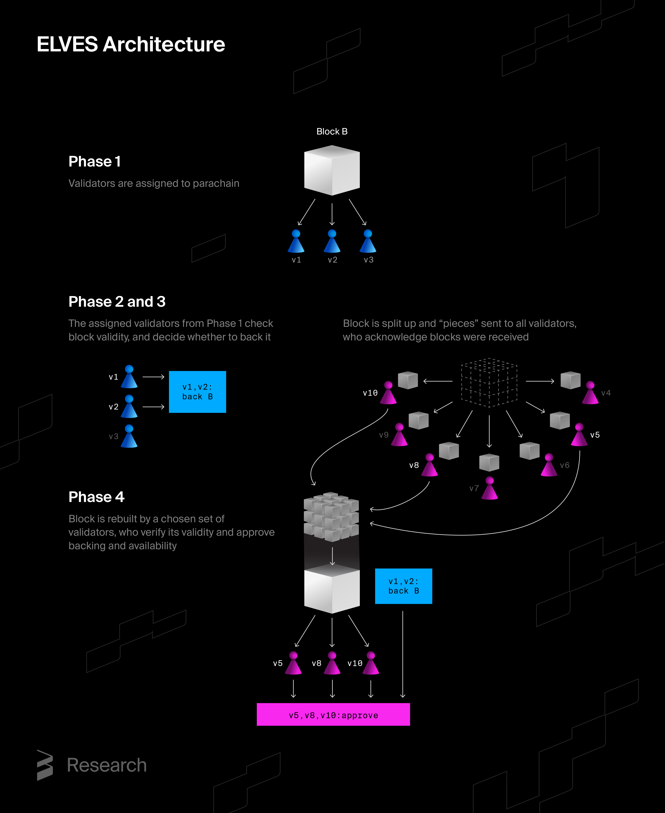

# ELVES: The Fairy Dust that Makes Polkadot Scalable

In mythology, elves have long been known as symbols of efficiency, security, and harmony. Polkadot and Kusama also have their own ELVES, a key protocol developed by the Web3 Foundation research team to help both blockchain networks achieve greater security and scalability. This blog post aims to introduce the protocol, explain how it works, and outline the ultimate benefits for users.

## The basics
A blockchain protocol usually consists of a network of nodes, typically ranging from hundreds to thousands. Each node downloads and verifies every block of transactions before participating in a majority decision to finalize them. The process keeps the blockchain secure under the assumption that at least two-thirds of the nodes behave correctly. And even if up to about thirty percent of the nodes fail or are hacked, the blockchain remains secure. Building on this premise, the focus shifts to a Proof-of-Stake (PoS) set up and, consequently, to the cryptoeconomic security of Polkadot and Kusama.

## The scalability dilemma
One of the main drawbacks of securing blockchain as described above is that it limits scalability. The process quickly becomes inefficient since every node must verify each block. Yet, decentralization and security require maintaining a substantial number of nodes. This creates a dilemma, as the system’s scalability ultimately depends on the throughput of the nodes with the lowest capacity.

## Polkadot’s architecture saves the day
Parallelism and data partitioning, breaking large datasets into smaller and more manageable pieces, are fundamental to addressing scalability challenges. Web2 relies heavily on data partitioning to handle data volumes and user requests. As a core architecture strategy, it enables systems to serve users globally with low latency and high availability. These same principles are also integral to Polkadot’s architecture, which has been designed for greater scalability from the outset.

In Polkadot’s configuration, validators do not process every transaction unlike in many other blockchains. They neither execute every transaction nor download them all, saving significant bandwidth. This efficiency is achieved through a two-tier design: transactions are submitted to parachains (Layer 2 chains), and parachain blocks are then committed to by the relay chain (Layer 1), where they are ultimately finalized and secured. While BABE enables block production and GRANDPA finalizes the chain at the relay chain level (Layer 1), every validator must still download and execute relay chain blocks. Under these conditions, where fewer than one-third of validators check the validity of each block, the question arises: how can cryptoeconomic security still be ensured?

## The role of ELVES
ELVES, a Polkadot protocol, enables the reliable and efficient transfer of parachain blocks from creation to inclusion. It allows parachains to run in parallel while maintaining strong security guarantees, which translates into network scalability without compromising security.

The following illustration shows a schematic of the ELVES protocol in four phases, outlining the process of validating a parachain block B. In this example, a total of ten validators participate. Validators (v1,v2,v3), who are assigned to a parachain, take part in phase 1 and 2, while all validators (v1,…,v10) participate in phase 3 and 4.

- **Phase 1.** The three validators (v1,v2, v3) assigned to the parachain receive the block.
- **Phase 2.** These validators check the validity of the received parachain block and decide whether to back it (i.e., guarantee its validity). In the image, validators v1 and v2 decide to back block B.
- **Phase 3.** The block is then split (erasure-coded) into “pieces”, which are then sent to all validators. Each validator acknowledges the pieces they receive. This ensures that all validators have access to the block so that they can later double-check its validity. At this stage, availability is guaranteed.
- **Phase 4** ensures that the parachain validators from Phase 1 have not misbehaved. A randomly selected subset of all validators, such as v5, v8, v10 in the image and who in the previous phase received the block pieces, reconstructs the block, verifies its validity, and approves the backing (the guarantee given in Phase 2 by parachain validators, for instance v1 and v2). At this stage, validity is guaranteed.

While three validators are assigned to each parachain in this example, in reality, the total number of validators is much higher, approximately 600 on Polkadot and 1,000 on Kusama.

Developed by the Web3 Foundation, the ELVES protocol is a scaling solution that balances security, decentralization, and scalability, making attacks on Polkadot extremely expensive in expectation. It also reduces computational load on validators while maintaining a high level of security.

## How does ELVES reduce computing power for validators?
ELVES reduces the computing power by letting a small subset of nodes validate each block. Selecting this random subset of sufficient size and defining how it determines block validity are the first steps toward reducing overall computational demand.

If the chosen subset contains a majority of honest parties, a simple vote could validate the block. Yet, ensuring that a random subset includes a majority of honest nodes requires the subset to be quite large. Concrete calculations show that such a random subset would still need several hundred nodes, making it expensive.

ELVES improves efficiency by requiring all nodes in the random committee to approve a validated block. As a result, the presence of even a single honest node in the subset is enough to ensure security. Moreover, ELVES guarantees, with sufficient probability, that the initial random subset includes an honest node. It also relies on economic security, as nodes must provide collateral, putting real “skin in the game.”

The process begins by selecting a very small initial random subset. If some committee members fail to show up, additional members are gradually added. And if enough members still do not participate, the entire set eventually validates the block. Since multiple blocks can be validated in parallel and an adversary can only expand a few subsets at a time, most blocks end up with validating subsets of relatively small size. This mechanism ensures that if any contradiction arises within a validating subset, the corrupted node loses its deposit.

On average, this approach requires only about 80 nodes, a number that can be even smaller in optimistic cases, such as when the system is not under attack. As a result, using ELVES saves more than 90% of computing power on average compared to having all validators check every block. In some cases, the savings reach up to 97%.

## How is ELVES deployed?
ELVES has been deployed on Polkadot and Kusama since 2020–2021. More recently, the Web3 Foundation team demonstrated its security in a dedicated paper. The study shows that the protocol remains secure if, for each parachain block, 25 validators are initially selected as approval checkers, resulting in about 17 honest validators in expectation. This holds because, at the time when parachain validators back a block, it is not yet known which validators will be randomly chosen, meaning the adversary cannot predict how many approval checkers will be honest. The selection of validators for Phase 3 approvals must occur after parachain validators have backed the block. Furthermore, ELVES adjusts the number of validators required for approval when nodes are unavailable, ensuring both scalability and strong resilience for Polkadot.

## ELVES contribution to Polkadot’s economic resilience
Due to the design of the ELVES protocol, any economic attack on Polkadot is extremely expensive, as for an attack to occur, the attacker must commit to malicious behavior, such as backing an invalid block. This should happen even before knowing which validators will be randomly selected to verify their actions. Since most validators are presumably honest, the likelihood that no honest node detects the attack is virtually zero. The expected value of an attack, defined as its potential payoff times its probability of success, is therefore negligible.

While the potential gains from an attack could reach millions of dollars, the odds of going undetected are close to zero. This makes such an attempt economically irrational since the attack would need to be carried out many times to have any chance of success. In theory, large-scale attacks on consensus, such as those requiring control of one-third of all validators, would be cheaper. Yet in practice, the cost of acquiring and maintaining that level of control makes them virtually impossible. If an attacker is caught, they are slashed, losing all their staked funds and the right to earn future rewards.

## What does this mean for users?
ELVES enables scalability for both Kusama and Polkadot, allowing the networks to achieve at least 140,000 transactions per second while using less than a quarter of their total capacity. These figures are not theoretical estimates or results from testnet experiments. [The Spammening experiment](https://data.parity.io/spammening), conducted on a production network at the end of 2024, provides solid evidence of these real throughput results.

Polkadot’s scalability and decentralization, achieved in part through ELVES, translate into direct benefits for users. Here are a few:

- **Lower risk of high transaction costs** during periods of heavy network traffic, a difficulty users have faced on other blockchains like Ethereum.
- **Support for high-throughput applications**, such as gaming platforms. [Mythical Games](https://mythicalgames.com/)is a clear example of Polkadot’s realisation: thanks to Polkadot, players and developers successfully migrate their tokens from Ethereum to Mythos.
- **Room for growth**, as Polkadot’s architecture allows for more parachains and projects, increasing usage diversity across the network.
- **Enhanced security through more decentralization**, as reducing the cost of becoming a Polkadot validator leads to increased decentralization, which in turn ensures stronger protection for users.

Like the elves of legend who work, protect, and preserve balance tirelessly behind the scenes, Polkadot’s ELVES operates quietly, yet powerfully to ensure security and scalability,

Aside from this blog post, the Parity research team has also created a [video](https://www.youtube.com/watch?v=m2_EpLj8hK0) that gives a quick and clear explanation of ELVES. Enjoy!
