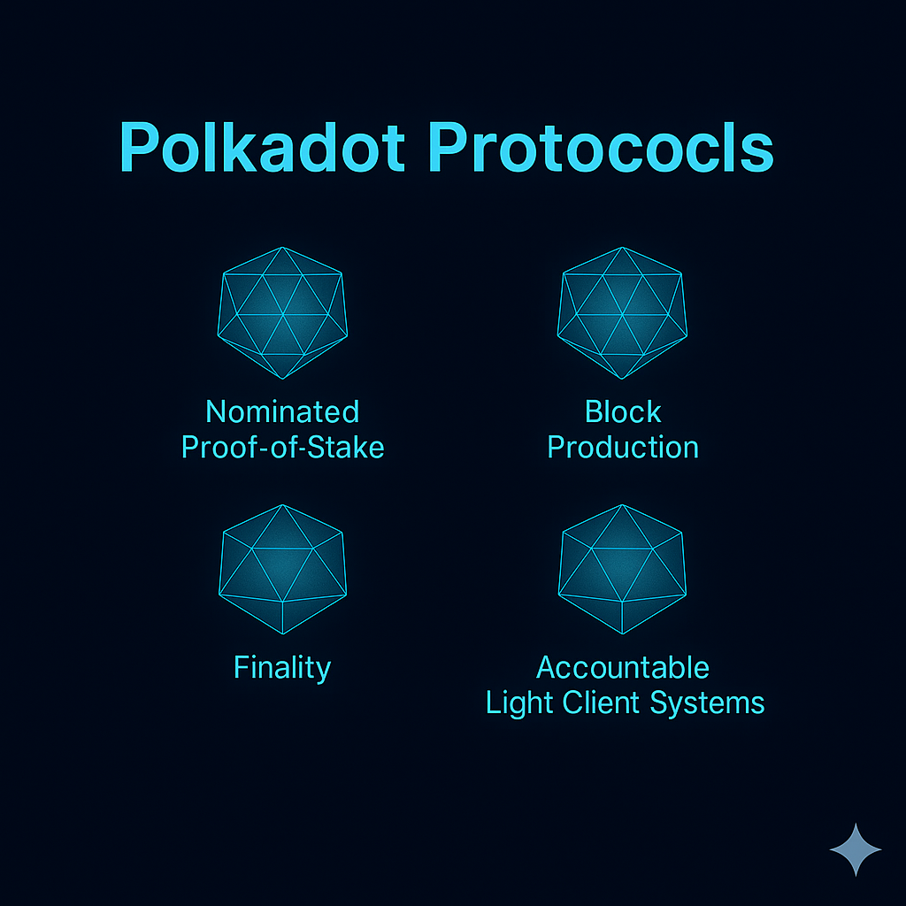

import DocCardList from '@theme/DocCardList';

This section provides a detailed description of some of the subprotocols that comprise Polkadot. The focus is largely on end-to-end mechanics and the properties relevant at this layer; for point-to-point mechanics, see `networking`.

<DocCardList />
