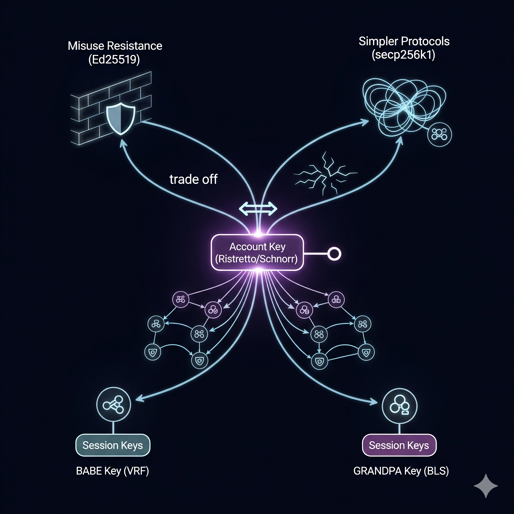

## Ristretto

Polkadot accounts should primarily use Schnorr signatures, with both the public key and the `R` point in the signature encoded using the [Ristretto](https://ristretto.group) point compression for the Ed25519 curve. It is recommended to collaborate with the [dalek ecosystem](https://github.com/dalek-cryptography), for which Ristretto was developed, while providing a simpler signature crate. The [Schnorr-dalek](https://github.com/w3f/schnorr-dalek) library offers a first step in that direction.

Account keys must support the diverse functionality expected of account systems like Ethereum and Bitcoin. To that end, Polkadot keys use Schnorr signatures, which enable fast batch verification and hierarchical deterministic key derivation, as outlined in [BIP32](https://github.com/bitcoin/bips/blob/master/bip-0032.mediawiki#Child_key_derivation_CKD_functions). Features from the [Bitcoin Schnorr wishlist](https://github.com/bitcoin/bips/blob/master/bip-0340.mediawiki) further highlight the advantages of Schnorr signatures, including:

 - Interactive threshold and multi-signatures
 - Adaptor signatures, and potentionally blind signatures, for swaps and payment channels. 

Since account keys are expected to remain valid for decades, conservative curve choices are essential.  In particular, pairing-based cryptography and BLS signatures should be avoided for account-level operations. This comes at the cost of true aggregation when verifying blocks, and reduces support for highly interactive threshold and multi-signature schemes.[^1] 

In the past, choosing between more secure elliptic curves involved a subtle trade-off: 

 - Misimplementation resistance is stronger with Edwards curves, such as Ed25519
 - Misuse resistance is stronger with curves that have a cofactor of 1, such as secp256k1

Historically, misuse resistance was a major selling point for Ed25519, which is itself a Schnorr variant. This resistance applies only to the basic properties of the signature scheme.  Advanced signature functionalities, beyond batch verification, tend to break precisely because of Ed25519's misuse resistance.  

There are tricks for implementing hierarchical deterministic key derivation (HDKD) on Ed25519, such as those used in [hd-ed25519](https://github.com/w3f/hd-ed25519). Yet, most prior attempts [resulted in insecure designs](https://forum.web3.foundation/t/key-recovery-attack-on-bip32-ed25519/44).

secp256k1 is a strong candidate among cofactor-1 curves, which simplify the implementation of advanced cryptographic protocols. Concerns remain, as such curves appear at least slightly weaker than Edwards curves and are generally more difficult to implement securely due to their incomplete addition formulas, which require more rigorous review (see [safecurves.cr.yp.to](https://safecurves.cr.yp.to)). While it is possible to ensure solid implementations within Polkadot itself, controlling the choices elsewhere in the ecosystem, particularly by wallet software, is far more challenging. 

In short, the ideal would be an Edwards curve without a cofactor, though such a curve does not exist. A practical alternative is an Edwards curve with cofactor 4, combined with [Mike Hamburg's Decaf point compression](https://www.shiftleft.org/papers/decaf/), which enables serialising and deserialising points on the subgroup of order $l$, offering a robust solution.

[Ristretto](https://ristretto.group) extends this compression technique to cofactor 8, making it compatible with the Ed25519 curve.  Implementations are available in both [Rust](https://doc.dalek.rs/curve25519_dalek/ristretto/index.html) and [C](https://github.com/Ristretto/libristretto255). If needed in another language, the compression and decompression functions can be implemented using an existing field arithmetic library, and are relatively easy to audit.  

In plain words, "Rather than relying on bit-twiddling, point mangling, or other kludged ad-hoc fixes, Ristretto offers a thin layer abstraction that provides protocol implementors with a clean, prime-order group."

## Additional signature types

It is possible to support multiple signature schemes for accounts, ideally with each account using only a single signature scheme and possessing just one public key. In fact, there are at least three or four additional signature types worth considering.

By supporting Ed25519, compatibility with HSMs and similar hardware may be improved.  It's security is equivalent to Ristretto-based Schnorr signatures for typical use cases.  Although a secure HDKD solution exists, users may encounter issues with existing tools that implement HDKD in less secure ways.

secp256k1 keys were initially used to allocate DOT, as they are compatible with ECDSA signatures on Ethereum. These same keys can alternatively be used with Schnorr or EdDSA signatures and restricted to outgoing transfers only, with the expectation that they will be phased out within the first six months. Alternatively, long term support for secp256k1 keys may be retained, either to leverage the secp vs secq duality or to accommodate legacy infrastructure, such as exchanges.

One possibility is to develop a delinearized variant of the proof-of-possesion-based mBCJ signatures described on pages 21 and 22 of [this paper](https://eprint.iacr.org/2018/417.pdf), which enables two-round trip multi-signatures.  In contrast, all current Schnorr multi-signature schemes require three round trips (see [this issue](https://github.com/w3f/schnorrkel/issues/15)). Such a delinearized variant of mBCJ would likely use Ristretto keys as well, though it would involve a different signature scheme.

Supporting BLS12-381 signatures enables true aggregation.  These could also be integrated with how session keys appear on-chain, though no compelling argument currently justifies doing so.

---

[^1] Aggregation can significantly reduce signed message size when applying numerous signatures. If performance is the sole objective, batch verification techniques offer similar benefits and are available for many signature schemes, including Schnorr.  Reducing interactivity in threshold and multi-signaturtes presents clear advantages, though parachains on Polkadot can always provide these features. 

Importantly, all known pairing-friendly elliptic curves suffer from various weaknesses, and the most fundamental issue lies in pairing itself: $e : G_1 \times G_2 \to G_T$. Elliptic curves are used precisely because they offer some insulation from advances in number theory. Yet, any known pairing maps into a target group $G_T$, which reintroduces vulnerabilities and enables faster attacks based on index calculus and related techniques.  

A real world example is the BN curve used during ZCash development, which was later found to have weaknesses. After launch, the team had to design and migrate to a [new curve](https://z.cash/blog/new-snark-curve/) to restore security margins. Similar transitions are expected in the future, for much the same reason that RSA key sizes gradually increase over time. 

**For further inquieries or questions please contact**: [Jeff Burdges](/team_members/jeff.md)
