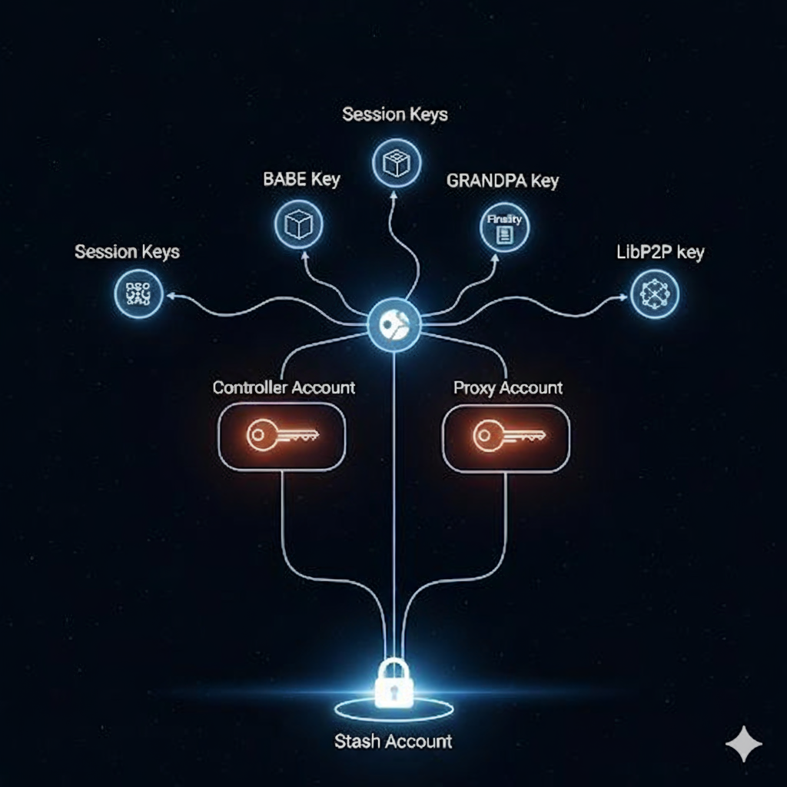

<!---->

In Polkadot, different keys and key types grant access to essential permissions and functionalities.  Roughly, categories are: account keys, which users interact with directly, and session keys, which nodes manage without operator intervention beyond the certification process.

## Account keys

Account keys have an associated balance, portions of which can be _locked_ to participate in staking, resource rental, and governance. These locks may include a waiting period before funds are fully unlocked. The system supports multiple locks with varying durations to accommodate the different restrictions of each role and to enable concurrent unlocking periods.

Active participation in these roles is encouraged, though they all occasionally require signatures from account holders. At the same time, account keys benefit from stronger physical security when stored in inconvenient locations, like safety deposit boxes, making signing arduous.  This friction for users can be mitigated as follows.

Accounts become _stash accounts_ when locking funds for staking. Each stash account registers an on-chain certificate that delegates all validator operations and nomination powers to a designated _controller account_, and also assigns a _proxy key_ for governance voting.  In this state, the controller and proxy accounts can sign on behalf of the stash account for staking and governance functions, respectively, but cannot transfer funds.

The locked funds in the stash account benefit from enhanced physical security, while still actively participating (via signatures) through their controller or proxy account keys.  At any time, the stash account can replace its controller or proxy keys, for instance, if operational security mistakes may have compromised either.

At present, account keys are supported by both Ed25519 and schnorrkel/Sr25519. These are Schnorr-like signatures implemented using the Ed25519 curve that offer very similar levels of security. For users who require HSM support or other external key management solution, Ed25519 keys are a suitable choice. Meanwhile, schnorrkel/Sr25519 provides more blockchain-friendly features like HDKD and multi-signature capabilities.

In particular, schnorrkel/Sr25519 uses the [Ristretto](https://doc.dalek.rs/curve25519_dalek/ristretto/index.html) implementation described in section 7 of Mike Hamburg's [Decaf](https://eprint.iacr.org/2015/673.pdf) paper. Ristretto provides the 2-torsion free points of the Ed25519 curve as a prime-order group. By avoiding the cofactor, Ristretto makes the implementation of more complex cryptographic protocols significantly safer. 

Blake2b is used for most conventional hashing operations in Polkadot, but schnorrkel/sr25519 itself relies on the [merlin](https://doc.dalek.rs/merlin/index.html) limited implementation of Mike Hamberg's [STROBE](http://strobe.sourceforge.io/), which is based on Keccak-f(1600) and offers a hashing interface well suited for signatures and non-interactive zero knowledge (NIZKs).  

For more detailed design notes, see the [announcement on GitHub](https://github.com/w3f/schnorrkel/blob/master/annoucement.md).

## Session keys

All session keys gain their authority from a session certificate, which is signed by a controller key who delegates the appropriate stake. Roughly, each session key fills a particular role either in consensus or security.  

The controller key can pause or revoke this session certificate and/or issue a replacement with new session keys at any time.  New session keys can be registered in advance, and some must be, so validators can smoothly transition to new hardware by issuing session certificates that become valid in a future session.  It is recommended to use "pause" for emergency maintenance and "revocation" in case a session key may have been compromised.

As a suggestion, session keys should remain tied to a single physical machine. Validator operators should issue the session certificate using the RPC protocol, without handling the session secret keys. In particular, duplicating session secret keys across machines is strongly discouraged, as such "high availability" designs almost always result in validator slashing. Whenever new validator hardware needs to be started quickly, the operator should first launch the new node and then certify the newly generated session keys using the RPC protocol.

No prior restrictions are imposed on the cryptographic algorithms used by specific substrate modules or the associated session keys types.

In BABE, validators use Schnorrkel/sr25519 keys both for a verifiable random function (VRF) based on [NSEC5](https://eprint.iacr.org/2017/099.pdf), as well as for standard Schnorr signatures.

A VRF is a public-key analog of a pseudo-random function (PRF), that is, a cryptographic hash function with a distinguished key, as seen in many MAC constructions. Block production slots are awarded when a block producer generates a sufficiently low VRF output, denoted as $\mathtt{VRF}(r_e || \mathtt{slot_number} )$. This allows anyone with the corresponding VRF public keys to verify that blocks were produced in the correct slot, while only block producers, using their VRF secret keys, can determine their slots in advance.

As in [Ouroboros Praos](https://eprint.iacr.org/2017/573.pdf), a source of randomness $r_e$ for the VRF inputs is provided by hashing together all VRF outputs from the previous session. This approach requires the registration of BABE keys at least one full session before they are used.

Hashing the signer's public key alongside the input helps reduce VRF output malleability, significantly improving security when used with HDKD. Additionally, hashing the VRF input and output together when producing output for use elsewhere, improves compossibility in security proofs. For reference, see the 2Hash-DH construction in Theorem 2 on page 32, Appendix C of ["Ouroboros Praos: An adaptively-secure, semi-synchronous proof-of-stake blockchain"](https://eprint.iacr.org/2017/573.pdf).

In GRANDPA, validators vote using BLS signatures, which support efficient signature aggregation and utilize ZCash's BLS12-381 curve for performance.  However, there is a risk that BLS12-381 could fall significantly below 128-bit security due to potential advancements in the number field sieve algorithm.  If and when this occurs, upgrading GRANDPA to another curve is expected to be straightforward. For further discussion, see this [CFRG mailing list thread](https://mailarchive.ietf.org/arch/msg/cfrg/eAn3_8XpcG4R2VFhDtE_pomPo2Q)

Libp2p transport keys are treated similarly to session keys, but they also encompass the transport keys for sentry nodes, not just for the validator.  As a result, operators interact with them more frequently.

## Old

First, a high-level view of the signing keys planned for use in Polkadot would be helpful. The discussion can then shift toward the certificate chain that links staked account keys to the session keys used for the proof-of-stake design.  In other words, the goal is to lay out the key questions surrounding the "glue" between keys roles, but this first requires introducing the full spectrum of those roles.

There are roughly four cryptographic layers in Polkadot:

 - [*Account keys*](1-accounts.md) are owned by users and tied to a single DOT-denominated account on Polkadot.  Accounts may be staked/bonded, unstaked/unbonded, or in the process of unstaking/unbonding. However, only an unstaked/unbonded account key can transfer DOT between accounts ([more](1-accounts-more.md)).
 - [*Nomination*](2-staking.md) establishes a certificate chain between staked (or bonded) account keys and the session keys used by nodes for block production and validation.  Since nominator keys cannot transfer DOT, they serve to insulate account keys that may remain air-gapped from the nodes actively operating on the internet.
 - [*Session keys*](3-session.md) consist of multiple keys grouped together to provide the various signing functions required by validators. These include several types of VRF keys.
 - [*Transport layer static keys*](https://forum.web3.foundation/t/transport-layer-authentication-libp2ps-secio/69) are used by libp2p to authenticate connections between nodes. These should either be certified by the session key or potentially incorporated directly into the session key.

**For further inquieries or questions please contact**: [Jeffrey Burdges](/team_members/jeff.md)

